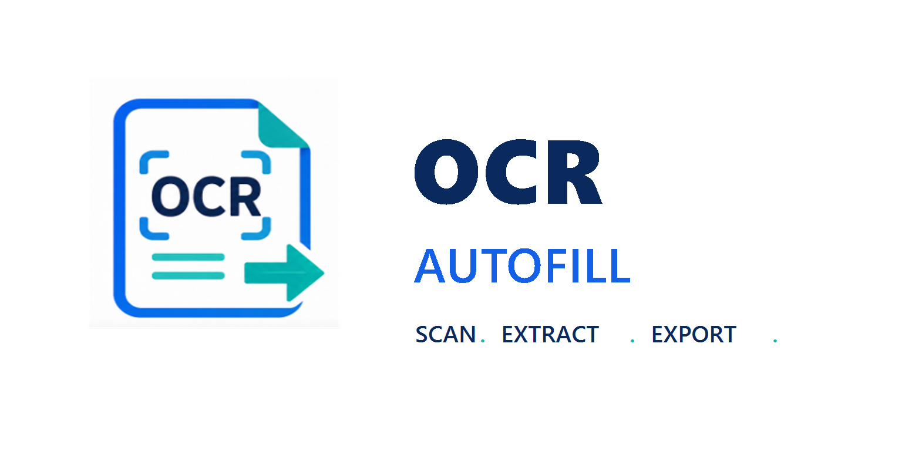

<p align="center">
  
</p>

[](https://github.com/Abijspy/intellifill-ocr/actions/workflows/release.yml)

# IntelliFill OCR Desktop

IntelliFill OCR is an offline desktop application for OCR-assisted document extraction, template table filling, validation, SQLite storage, and traceable exports.

The current app shell is built with Avalonia so the same UI can be distributed on Windows and Linux. It does not use cloud APIs.

## Current Features

- Avalonia desktop UI for Windows and Linux.
- Template upload for CSV, TXT, XLSX, DOCX, PDF, PNG, JPG, and JPEG.
- Multi-table template preview and output table selector.
- Source upload for up to five files with parsed text preview.
- Larger high-clarity image/PDF visual preview with zoom, reset, rotate, and rectangle OCR region selection.
- Tesseract OCR auto-detection from common install locations and PATH.
- Detected source table selector and parsed text preview.
- Extracted field list and manual source-to-cell mapping.
- Auto Fill using local fuzzy matching.
- Editable output preview before saving.
- Validation checks for required blanks, GST/GSTIN format, dates, amounts, and duplicates.
- SQLite save and database preview.
- Application log viewer.
- Settings for Tesseract path, SQLite path, and light/dark/system appearance.
- Exports to CSV, formatted XLSX, formatted DOCX, and multi-page PDF.
- PDF exports include one bottom traceability barcode/code on the final page.

## Install

Windows users should download the NSIS setup installer from GitHub Releases:

```text
IntelliFillOCR-<version>-setup-win-x64.exe
```

The NSIS installer supports:

- Current-user installation under `%LOCALAPPDATA%\Programs\IntelliFill OCR`
- Start Menu and desktop shortcuts
- Control Panel uninstall entry
- Visible install/uninstall details
- Optional Tesseract OCR 5.5.0 download/install component

Linux users can download one of:

```text
intellifill-ocr_<version>_amd64.deb
intellifill-ocr-<version>-1.x86_64.rpm
IntelliFillOCR-<version>-linux-x64.tar.gz
```

## Build Locally

Requirements:

- .NET 8 SDK
- NSIS 3.x for Windows setup builds

Build the Avalonia app:

```powershell
dotnet build src\IntelliFillOCR.Avalonia\IntelliFillOCR.Avalonia.csproj -c Release
```

Publish the Windows Avalonia app:

```powershell
.\scripts\build-avalonia.ps1 -Configuration Release -RuntimeIdentifier win-x64
```

Build the Windows NSIS installer:

```powershell
.\scripts\package-release.ps1 -Version 3.7.2 -RuntimeIdentifier win-x64
```

Output:

```text
installer\out\IntelliFillOCR-3.7.2-setup-win-x64.exe
```

Build Linux packages on Linux:

```bash
bash scripts/package-linux.sh 3.7.2 linux-x64 Release
```

## GitHub Release Pipeline

The package builder and publisher workflow is:

```text
.github/workflows/release.yml
```

It appears in GitHub Actions as `IntelliFill OCR Builder`.

It publishes:

- Windows NSIS setup EXE
- Debian/Ubuntu `.deb`
- Fedora `.rpm`
- Linux `.tar.gz`

Publish by pushing a tag:

```powershell
git tag v3.7.2
git push origin v3.7.2
```

Or run the workflow manually from GitHub Actions and enter the version.

## Repository Layout

```text
src/IntelliFillOCR.Avalonia/      Avalonia desktop application
src/IntelliFillOCR.Core/          Cross-platform document, export, and SQLite services
installer/IntelliFillOCR.nsi      NSIS Windows installer script
scripts/                          Build, version, and packaging scripts
assets/                           App icon and logo
demo/                             Small CSV demo fixtures
```

## Notes

- The old portable self-extracting updater EXE build has been removed.
- Configure local Tesseract and SQLite paths from Settings inside the app.
- Tesseract OCR itself remains local/offline once installed.
