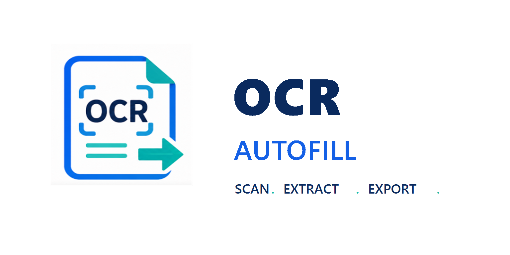

<p align="center">
  
</p>

<p align="center">
  Offline OCR, document extraction, table filling, validation, and traceable exports for Windows and Linux.
</p>

<p align="center">
  <a href="https://abishekprabakaran.com/intellifill-ocr/">Website</a> ·
  <a href="https://github.com/Abijspy/intellifill-ocr/releases/latest">Latest release</a> ·
  <a href="LICENSE">GNU GPL v3.0</a>
</p>

[](https://github.com/Abijspy/intellifill-ocr/actions/workflows/release.yml)

# IntelliFill OCR Desktop

IntelliFill OCR is a local-first desktop application for extracting information from documents, filling structured templates, reviewing results, saving audit data to SQLite, and exporting traceable PDF, Word, Excel, and CSV files. The desktop interface is built with Avalonia and does not require a cloud OCR API.

## Highlights

- Native desktop interface for Windows and Linux.
- Imports CSV, TXT, XLSX, DOCX, PDF, PNG, JPG, and JPEG templates.
- Uploads up to five source documents with parsed-text and detected-table previews.
- Image and PDF workspace with zoom, rotation, and rectangular OCR region selection.
- Local Tesseract OCR detection and configuration.
- Manual field mapping and local fuzzy-matching Auto Fill.
- Editable output preview and validation for required values, GST/GSTIN, dates, amounts, and duplicates.
- Local SQLite run history and database preview.
- CSV, XLSX, DOCX, and multi-page PDF exports.
- Configurable traceability IDs shared by database records, filenames, previews, exports, and barcodes.
- System, light, and dark themes with selectable cross-platform accent colors.
- Windows installer updates and native APT/DNF update integration on Linux.

## Supported Platforms

| Platform | Architecture | Recommended package | Update method |
|---|---:|---|---|
| Windows 10/11 | x64 | NSIS setup `.exe` | In-app release check |
| Debian/Ubuntu | amd64 | APT repository or `.deb` | `apt upgrade` |
| Fedora/RHEL | x86_64 | DNF repository or `.rpm` | `dnf upgrade` |
| Other x64 Linux | x64 | Portable `.tar.gz` | Replace with a newer release |

The current packaged releases do not support ARM, ARM64, x86/i386, or 32-bit Linux.

## Windows Installation

### Install with the setup program

1. Open the [latest GitHub release](https://github.com/Abijspy/intellifill-ocr/releases/latest).
2. Download `IntelliFillOCR-<version>-setup-win-x64.exe`.
3. Run the installer. If Windows SmartScreen appears, confirm that the file came from this official repository before continuing.
4. Keep the optional Tesseract OCR component selected if Tesseract is not already installed.
5. Start IntelliFill OCR from the Start Menu or desktop shortcut.

The installer creates a per-user installation under:

```text
%LOCALAPPDATA%\Programs\IntelliFill OCR
```

It also creates Start Menu and optional desktop shortcuts, plus an uninstall entry in Windows Settings and Control Panel.

### Configure Tesseract on Windows

OCR region extraction requires Tesseract. The installer can install Tesseract 5.5.0, or you can install it separately and configure its executable in **Settings → Local Paths**.

The common path is:

```text
C:\Program Files\Tesseract-OCR\tesseract.exe
```

Use **Auto Detect** first. If detection fails, select the executable with **Browse**.

### Update on Windows

Open **Settings → Software Updates → Check for Updates**. The app checks the latest GitHub release and can download and launch the matching Windows installer. Close active document work before completing an installer update.

You can also download and run the newest setup program manually. Installing a newer version over the existing installation preserves user settings and the SQLite database stored in your local application-data folder.

### Uninstall on Windows

Open **Settings → Apps → Installed apps**, select **IntelliFill OCR**, and choose **Uninstall**. The application installation is removed; locally created exports and user-selected SQLite databases are not deleted.

## Linux Installation

The recommended Linux installation uses the official package repository. Once configured, IntelliFill OCR updates alongside the rest of the system through APT or DNF. The repositories retain the three newest package versions; older artifacts remain available from [GitHub Releases](https://github.com/Abijspy/intellifill-ocr/releases).

Repository endpoints:

- APT: `https://packages.abishekprabakaran.com/apt`
- DNF: `https://packages.abishekprabakaran.com/rpm/$basearch`
- Signing key: `https://packages.abishekprabakaran.com/keys/intellifill-ocr-archive-keyring.gpg`

### Debian and Ubuntu with APT

Install the signing key and repository definition:

```bash
sudo install -d -m 0755 /usr/share/keyrings /etc/apt/sources.list.d
sudo curl -fsSL \
  https://packages.abishekprabakaran.com/keys/intellifill-ocr-archive-keyring.gpg \
  -o /usr/share/keyrings/intellifill-ocr-archive-keyring.gpg
echo "deb [arch=amd64 signed-by=/usr/share/keyrings/intellifill-ocr-archive-keyring.gpg] https://packages.abishekprabakaran.com/apt stable main" | \
  sudo tee /etc/apt/sources.list.d/intellifill-ocr.list >/dev/null
sudo apt update
sudo apt install intellifill-ocr
```

Update later with normal system maintenance:

```bash
sudo apt update
sudo apt upgrade
```

The explicit `arch=amd64` setting prevents APT from requesting unsupported i386 package indexes.

### Fedora and RHEL with DNF

Install the repository definition and application:

```bash
sudo install -d -m 0755 /etc/yum.repos.d
sudo curl -fsSL \
  https://packages.abishekprabakaran.com/intellifill-ocr.repo \
  -o /etc/yum.repos.d/intellifill-ocr.repo
sudo dnf makecache
sudo dnf install intellifill-ocr
```

Update later with:

```bash
sudo dnf upgrade
```

### Automatic repository setup from the app

Version 4.2.0 and newer provides **Settings → Software Updates → Check Linux Package Repository**. It detects Debian/Ubuntu or Fedora/RHEL, verifies the expected repository configuration, and offers to add a missing repository through the desktop administrator-authentication prompt.

The app does not download or replace Linux packages itself. After repository setup, APT or DNF remains responsible for checking, installing, rolling back, and auditing system packages.

### Install a downloaded DEB or RPM

If you do not want to configure a repository, download a package from the [latest release](https://github.com/Abijspy/intellifill-ocr/releases/latest).

Debian/Ubuntu:

```bash
sudo apt install ./intellifill-ocr_<version>_amd64.deb
```

Fedora/RHEL:

```bash
sudo dnf install ./intellifill-ocr-<version>-1.x86_64.rpm
```

The packaged installer adds the official repository automatically. If the repository was unavailable during installation, use the in-app repository check or the manual commands above.

### Portable Linux archive

The release also includes `IntelliFillOCR-<version>-linux-x64.tar.gz`. Extract it to a user-writable directory and run `IntelliFillOCR`. Portable installations do not register a desktop launcher or package repository automatically.

### Linux desktop launcher and icon

DEB and RPM packages install:

```text
/usr/bin/intellifill-ocr
/usr/share/applications/intellifill-ocr.desktop
/usr/share/icons/hicolor/512x512/apps/intellifill-ocr.png
```

If the launcher or icon does not appear immediately, sign out and back in or refresh the desktop database and icon cache:

```bash
sudo update-desktop-database /usr/share/applications 2>/dev/null || true
sudo gtk-update-icon-cache -q -t -f /usr/share/icons/hicolor 2>/dev/null || true
```

### Remove IntelliFill OCR on Linux

Debian/Ubuntu:

```bash
sudo apt remove intellifill-ocr
sudo rm -f /etc/apt/sources.list.d/intellifill-ocr.list
sudo apt update
```

Fedora/RHEL:

```bash
sudo dnf remove intellifill-ocr
sudo rm -f /etc/yum.repos.d/intellifill-ocr.repo
```

Removing the package does not delete exports or user-selected database files.

## Repository Security

- APT metadata is published with a signed `InRelease` file and a key restricted through `signed-by`.
- Do not add `trusted=yes` to the APT source.
- DNF validates signed repository metadata with `repo_gpgcheck=1`.
- Package repositories and release assets are rebuilt by GitHub Actions from version tags.
- The custom package domain is backed by the project's GitHub Pages deployment.

## First-Run Configuration

1. Open **Settings → Local Paths** and auto-detect or select Tesseract.
2. Confirm or choose the SQLite database path.
3. Select the system, light, or dark theme and preferred accent color.
4. Choose a traceability-ID mode.
5. Run **Diagnostics and Storage → Run System Readiness Check**.
6. On Linux, verify the package source under **Software Updates**.

Application settings and logs use the operating system's local application-data location under an `IntelliFillOCR` directory. The default SQLite database is also created there unless you select a different path.

## Basic Workflow

1. Upload the template that defines the output tables.
2. Upload one or more source documents.
3. Review detected text and tables, or select an image/PDF region for OCR.
4. Map extracted fields to destination cells manually or use Auto Fill.
5. Correct output values and run validation.
6. Save the run to SQLite when an audit record is needed.
7. Preview and export PDF, Word, Excel, or CSV output.

## Command-Line Interface

The Windows installer and Linux DEB/RPM packages include the `intellifill` command. It uses the same local document parser and export services as the desktop application. PDF and image scans are rasterized locally and processed with the installed Tesseract executable.

Scan an invoice and create XLSX and PDF output in the current directory:

```bash
intellifill scan invoice.pdf
```

Choose formats and an output directory:

```bash
intellifill scan receipt.png --format csv,xlsx,docx,pdf --output ./exports
```

Select another Tesseract language or executable:

```bash
intellifill scan invoice.pdf --language eng --tesseract /usr/bin/tesseract
```

Scan without exporting, or return a machine-readable result for scripts:

```bash
intellifill scan report.docx --no-export
intellifill scan invoice.pdf --no-export --json
```

Available options:

| Option | Purpose |
|---|---|
| `-o, --output <directory>` | Select the export directory. |
| `-f, --format <list>` | Select comma-separated `csv`, `xlsx`, `docx`, and `pdf` formats. |
| `-l, --language <code>` | Select the installed Tesseract language; the default is `eng`. |
| `--tesseract <path>` | Use an explicit Tesseract executable. |
| `--no-export` | Extract and validate without writing exports. |
| `--json` | Print structured JSON suitable for automation. |

Run `intellifill --help` for command help or `intellifill --version` for the installed CLI version. On Windows, open a new terminal after installation so the updated user `PATH` is loaded.

## Troubleshooting

### APT reports that the repository has no Release file

Confirm the source uses the exact HTTPS URL and distribution shown below:

```text
deb [arch=amd64 signed-by=/usr/share/keyrings/intellifill-ocr-archive-keyring.gpg] https://packages.abishekprabakaran.com/apt stable main
```

Then run `sudo apt update`. If the error continues, check the [Actions page](https://github.com/Abijspy/intellifill-ocr/actions) because repository publication may still be running after a new release.

### APT mentions an unsupported i386 Packages file

Ensure the source includes `arch=amd64`. Remove older IntelliFill OCR source entries that omit the architecture restriction.

### APT or DNF does not find a newly released update

The release builder completes before the package-repository publisher. Wait for both GitHub Actions workflows to finish, then refresh metadata:

```bash
sudo apt update
# or
sudo dnf clean metadata && sudo dnf makecache
```

### OCR is unavailable

Install Tesseract, then use **Settings → Local Paths → Auto Detect**. Confirm the configured executable exists and run the system readiness check.

### Linux repository setup cannot request administrator access

The in-app setup uses `pkexec`. Install the distribution's PolicyKit integration or use the manual APT/DNF commands in this README.

## Build Locally

Requirements:

- .NET 8 SDK
- Tesseract OCR for region-extraction testing
- NSIS 3.x for Windows installer builds
- `dpkg-deb`, RPM tools, and `alien` for Linux package builds

Build the application:

```bash
dotnet build src/IntelliFillOCR.Avalonia/IntelliFillOCR.Avalonia.csproj -c Release
```

Build the Windows installer from PowerShell:

```powershell
.\scripts\package-release.ps1 -Version 5.0.0 -RuntimeIdentifier win-x64
```

Output:

```text
installer\out\IntelliFillOCR-5.0.0-setup-win-x64.exe
```

Build Linux packages on Linux:

```bash
bash scripts/package-linux.sh 5.0.0 linux-x64 Release
```

Linux outputs are written under `release/linux/`.

## Release Automation

The `IntelliFill OCR Builder` workflow in `.github/workflows/release.yml` produces:

- Windows NSIS setup EXE
- Debian/Ubuntu DEB
- Fedora/RHEL RPM
- Portable Linux tarball

The package-repository workflow then publishes signed APT metadata and DNF repository metadata to the `gh-pages` deployment, retaining the three newest Linux package versions.

Create a release by pushing a version tag:

```bash
git tag v5.0.0
git push origin v5.0.0
```

The workflows can also be started manually from GitHub Actions with an explicit version.

## Repository Layout

```text
src/IntelliFillOCR.Avalonia/      Avalonia desktop application
src/IntelliFillOCR.Cli/           Cross-platform intellifill command
src/IntelliFillOCR.Core/          Document, export, and SQLite services
installer/IntelliFillOCR.nsi      Windows NSIS installer
scripts/                          Build, version, and packaging scripts
package-repository/               Repository signing material and configuration
assets/                           Application icons and branding
demo/                             Small CSV demonstration fixtures
website/                          Static official project website
```

## License

IntelliFill OCR is free software licensed under the [GNU General Public License v3.0](LICENSE).
